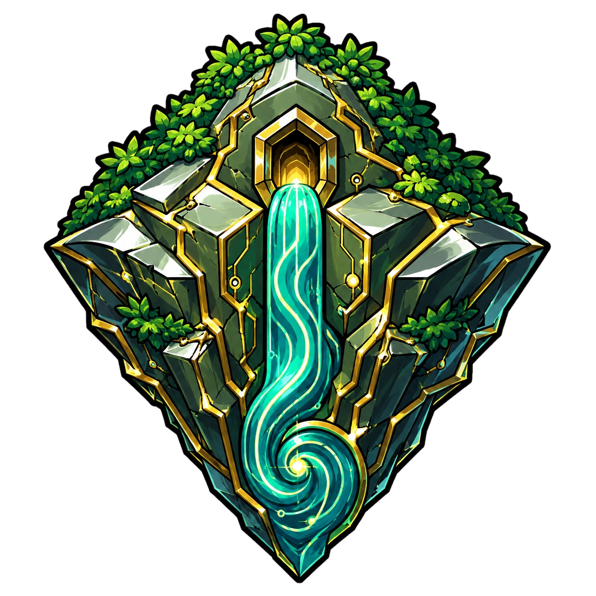

# Altepetl
Altepetl es una organización cuyo objetivo es realizar una transición ordenada de todas las formas de organización social actuales, sometidas, definidas y reglamentadas por el sistema económico capitalista.  Hacia nuevos esquemas sociales compartidos y colaborativos.  Evitando a toda costa el robo del plusvalor generado por todas las fuerzas productivas.
Esto mediante la definición de nuevos esquemas de organización social y trabajo.

De forma general lo que busca esta organización es mover a grupos sociales a través de diferentes tipos de organizaciones socio económicas, empezando por la que estamos actualmente, un capitalismo, sin ningún matiz. Esto debido a la concentración del capital en solo el 1% de la población mundial, esto nos indica que no hace falta entrar en detalles.

Partiendo entonces del sistema de Barbarie en el que vivimos tenemos que movernos a través de diferentes estadios organizacionales, sociales y económicos, alcanzando poco a poco un estado de equilibrio entre las fuerzas productivas y el consumo.  Que será apenas la base para un nuevo meta sistema económico y social e integral.
Donde el hombre no este privado de sus emociones, de sus sentimientos como si no tuvieran valor alguno y por tanto no existieran, generando una humanidad profundamente enferma.

Por tanto este nuevo meta sistema apenas será una base para la salud humana.

Ergo, Altepetl es una organización que tiene como objetivo crear una base económica y social para la salud humana.  Salud entendida en sentido integral: física, mental, emocional, espiritual y ambiental.

## Objetivo

Este nuevo metasistema económico y social que es el objetivo del Altepetl busca una etapa posterior a la ausencia de un aparato de Estado, es decir una vez alcanzado el equilibrio justo de las fuerzas productivas, integrar en el hombre conocimientos, no solo técnicos de este mundo material, sino que, también conocimiento emocional, que será la base para una nueva economía integral, con el hombre como centro de todo, no el capital.

Esta base será apenas el principio mínimo indispensable para construir un hombre sano.

A este nuevo sistema económico, social y humano de conocimiento le llamaremos Kinam.

El objetivo del Altepetl es construir el Kinam.

> Emociones

No reconocer la sensibilidad emocional del hombre, es en sí, un acto de violencia.
Nuestra sociedad actual, materialista, violenta perpetuamente al hombre.

**Reflexiona**

    ¿Cuantas personas forman tu circulo de soporte emocional?

Con suerte, durante toda la vida, solo hay una persona conoce y escucha tus sentimientos.

Esta persona no esta disponible para ti el 100% del tiempo, por lo tanto:

    Vivimos emocionalmente abandonados.

## Filosofía de la organización

### Misión

Crear un metasistema económico, social y humano justo y equitativo para todos.

### Visión

Con este nuevo meta sistema integrar el conocimiento emocional del hombre como parte vital para la salud del Ser.
Que este nuevo esquema de economía, sociedad y hombre sea la estructura base para alcanzar la salud del Hombre.

### Valores

La vida.
El hombre con todo lo que implica, aspectos físicos, mentales y emocionales.
El amor.
La Bondad.

Los valores serán la brújula que utilizará la organización para orientar los esfuerzos productivos, dando prioridad a las actividades que favorezcan los valores de la organización.

Si el principal valor de la organización es la vida, entonces las actividades de mayor prioridad serán las que favorezcan la vida, es decir, proyectos relacionados con:
1. Aire
2. Agua
3. Alimento

El orden es estricto, puesto que podemos vivir más tiempo sin alimento, que sin agua, y el recurso más indispensable es el aire que respiras.

### Registro en lugar de prohibición

El Altepetl no prohíbe: documenta.  Intentar escribir y detallar todo lo que no se puede hacer nos haría caer en un nivel muy bajo de razonamiento.

En cambio podemos describir con frases simples nuestro objetivo, si las acciones o razonamientos no respetan el objetivo y los valores de la organización no estarán prohibidas, simplemente se registran en el nivel más bajo de atención, tomando acciones de verdad importantes como prioridad.

Es obvio que sentimientos de superioridad están en contra de todo, incluso de la vida.  Creer que mereces más porque tienes más es un principio destructivo, este es el principio base del sistema económico capitalista, que está a punto de consumir al hombre y al planeta entero.

#### Registro, no prohibición

Toda actividad que en otro esquema organizacional sería prohibida, en el Altepetl se registra como proyecto y se marca como contradictoria con los valores de la organización.  Estos proyectos reciben un peso negativo en el sistema de priorización y no se atienden mientras su impacto negativo no se reduzca a un margen justo.  La organización no prohíbe, documenta.

Esta decisión no es inocua para quien realiza la actividad: se guarda registro de las actividades que contradicen los valores del Altepetl, y ese registro forma parte del historial de cada persona y de cada célula.  El propósito del registro es identificar grupos y personas con malas intenciones.  Por eso no se prohíbe nada: el registro es más preciso y más difícil de eludir que cualquier regla escrita, porque no depende de una sanción, depende del registro.

#### Quién determina qué es contrario a los valores

Preguntarse "¿quién determina y aplica qué es contrario a los valores?" es una reducción simplista del contexto del Altepetl.  Solo plantear la idea revela una mentalidad de competencia, ajena a esta organización: la pregunta presupone que alguien concentra la autoridad para juzgar.  En un contexto de colaboración esto lo determina la razón —la razón de las personas que participan en la organización, a través de sus organismos de gobierno.

El mecanismo es natural: desde la célula social más pequeña, los miembros del Calpulli dicen "esto va en contra de la vida", se registra y el proyecto no se atiende.  Si el proyecto escala de nivel, la Comunidad lo marca igual y se olvida.  No hay un juez central que decide; hay comunidades que razonan.

#### Proyectos controversiales

La mentalidad adecuada al contexto del Altepetl, para quien propone, es esta: tengo un proyecto que será controversial, porque tiene implicaciones que en un inicio parecen contrarias a la vida; entonces preparo un proyecto de investigación, datos, planificación y **análisis** robusto, y con todo eso como bandera camino por todas las escalas de la organización para defenderlo.  Quienes llevan el proyecto deben conquistar los corazones de su oposición.

Y para quien revisa: la misión de cada consejo que evalúa el proyecto no es solo refutarlo, es complementarlo —buscar soluciones que reduzcan su impacto negativo.  Si al final no se obtiene consenso y el costo negativo no se reduce, el proyecto sigue pendiente: no cae al fondo de una lista interminable, simplemente no se atiende hasta que se alcance un margen de daño que pueda considerarse justo en comparación con el beneficio obtenido.

Por ejemplo, el aborto: no se trata solo de prohibir o aprobar, se trata de resolver un problema más amplio.  Se apruebe o se prohíba, el trabajo de la organización es ese: buscar soluciones creativas, adaptadas a nuestro contexto actual, no al de hace cien años.

#### Capital financiero privado

El ingreso de capital financiero privado como inyección a la organización o a cualquiera de sus Calpullis es contrario a los valores fundamentales del Altepetl.

La razón es simple: gran parte del capital financiero se genera de forma antiética dentro del sistema capitalista, aceptarlo es importar esa inmoralidad al interior de la organización.  Permitir la entrada de capital privado es la receta exacta para controlar todo el proceso y regresar al sistema económico del que se busca salir.  No hay finanzas sanas con un sistema inmoral como el capitalismo.

Esta restricción no impide el comercio.  La organización puede vender productos y servicios al sector privado y captar recursos por esa vía.  Lo que no se acepta es capital como inversión, es decir, dinero que entra a cambio de control, propiedad o participación.  La frontera es clara: **comercio sí, capital como inyección no.**

## Dialéctica

El Kinam es la base de la salud.  Quien se opone al Kinam se opone, en efecto, a esa base, aunque puede no ser su intención.  Por eso la contradicción se trata con herramientas, no con represión.

Por diseño, Altepetl proveerá las herramientas técnicas para no caer en este tipo de contradicciones, al contrario, la contradicción enriquece el proceso.

Contar con las herramientas adecuadas permitirá ayudar a una microeconomía a prosperar con su propio marco de reglas y a otra prosperar con un marco de reglas totalmente opuesto.

Mientras el resultado sea el crecimiento de los tres factores: sociedad, economía y el hombre, el camino es el correcto, respetando los valores del Altepetl.

## El camino
Ahora bien, sería una aberración intentar hacerlo como se hizo el siglo pasado, por la vía armada, hoy todo ha cambiado, las herramientas al alcance son muy diferentes.

Esta migración debe ser técnica.

La técnica ha evolucionado de una forma inmensa, hoy contamos con técnicas y herramientas que permiten niveles de producción y administración social que el siglo pasado eran inimaginables.

Por poner solo un ejemplo, el bitcoin es una tecnología capaz de dividir la unidad en un billón de partes y llevar la traza de cada compra o venta de cada billonésima parte.  Esto no es planificación por sí mismo, es trazabilidad: la capacidad administrativa de registrar, a gran escala y con detalle fino, cada movimiento de valor.  Esa trazabilidad es precisamente la condición que antes faltaba.  Sin registro detallado no puede haber planificación seria; con él, sí.

Un sistema económico con sentido comunitario, social, planificado y auto administrado es perfectamente factible hoy en día, precisamente porque hoy existe esa capacidad de registro y seguimiento que antes no existía.

Se puede planificar, producción, distribución, venta, consumo, etc. a niveles nunca antes vistos.

La estrategia de nuestra organización es muy compleja, porque en sí, un proceso administrativo y planificado de producción es altamente complejo.

No hay una definición simple, puede haber un compendio de cientos de miles de términos simples que definen nuestro camino pero no uno solo.

A grandes rasgos este proceso tendrá las siguientes características:

- Crear sistema económico base para la salud del hombre.
- Este nuevo meta sistema económico y social le llamaremos: Kinam.
- Independencia de micro economías.
- A estas micro economías les llamaremos Calpulli (célula social básica).
- El corazón de todo es Organización Social, mientras haya participación el Altepetl tendrá fuerza de movimiento.
- Estas microeconomías (Calpullis) son organización social + producción + consumo + educación.
- El incentivo para participar en esta nueva organización será el cambio en las condiciones materiales del Calpulli.
- El Altepetl debe captar recursos económicos para poder moverse.
- La base de la organización Altepetl es el Trabajo Comunitario.
- El conocimiento técnico y la tecnología serán la base para organizar el trabajo comunitario dentro de los Calpullis.
- Uso y distribución transparente de todos los recursos.
- Migración de cada micro economía hacia una economía administrada, sin participación de capital financiero privado, sostenida con la fuerza productiva local y el financiamiento del propio Altepetl, sumada progresivamente a la inversión del Estado, para llegar a una independencia productiva, este sistema será el requisito básico para instalar los medios educativos que serán la base para el hombre sano, a esta etapa de equilibrio entre sociedad + economía + conocimiento le llamaremos: Kinam
- Las migraciones de cada microeconomía (Calpulli) son independientes, cada una lleva su ritmo, los pasos o estadios no son forzosos, solo sugeridos.  Nunca más economías globales.
- Creación de la definición de Calpullis ágiles.  Al igual que las metodologías ágiles, estos Calpulli deberán moverse a través de ciclos iterativos, cortos, medibles, alcanzables.  Al igual que las metodologías ágiles, mediante el análisis retrospectivo se garantiza corregir y alcanzar las metas.
- Las Calpullis no necesitan ser puramente autónomas, la organización Altepetl se encargará de proveer las redes de suministros, tanto de producción como de consumo.
- Todo el camino que recorra una Calpulli será documentado.
- Toda migración de cada Calpulli será planificada.
- La experiencia de otros Calpullis será analizada para ser tomada como referencia.
- Altepetl deberá proveer conocimiento, herramientas y redes de comunicación a los Calpullis para su desarrollo.
- Registro de todos los requerimientos de un Calpulli.
- Definición de prioridades para el ejercicio de los recursos dentro de un Calpulli.
- Definición de procesos, metodologías y estándares de desarrollo económico.  No como fin burocrático, sino como componente base para impulsar la velocidad de crecimiento de estas microeconomías ágiles, Calpulli.

## Kinam

El Kinam es el sistema económico y social que el Altepetl busca alcanzar.  Para llegar a él hay dos tiempos distintos que no se contradicen.

El primer tiempo es abrupto y es la piedra angular que mueve todo: **cambiar las condiciones materiales del Calpulli**.  Sin ese cambio material concreto —recursos financieros, infraestructura, herramientas— ningún proceso posterior es posible.  Este cambio sí debe ser radical e inmediato en el momento en que un Calpulli se incorpora al Altepetl.

Hay una precisión importante sobre el momento de esa incorporación: el proceso es por etapas.  Un Calpulli se integra al Altepetl cuando la plataforma ya está completa —con recursos financieros, técnicos y administrativos—, es decir, en una etapa ya avanzada del proyecto.  La organización no promete recursos que aún no tiene: primero construye la base (El Inicio, la captación, la plataforma) y solo entonces incorpora Calpullis con el compromiso material que sí puede cumplir.

El proyecto inicia de buena fe.  La buena fe es precisamente lo que representa una colaboración: quienes participan en las primeras etapas lo hacen para construir la plataforma, no para recibir de inmediato lo que la plataforma todavía no puede dar.  El cambio abrupto de las condiciones materiales es el compromiso de la etapa madura, no del primer día.

El segundo tiempo es lento, diverso y progresivo.  Una vez cambiadas las condiciones materiales, todo lo demás —el entorno, las relaciones sociales, las formas de producción, las formas de comunicación— empieza a moverse lentamente en la vertiente que el Altepetl propicia.  Al respetar la independencia e identidad de cada Calpulli, cada uno se mueve a su propio ritmo.  Este proceso diverso es el que, con el tiempo, alcanza el equilibrio que llamamos Kinam.

El trabajo del Altepetl como organización será proveer, planificar y administrar las relaciones entre Calpullis, buscando la maximización y el crecimiento de cada uno de ellos.  Esto se logrará proporcionando, primero los recursos financieros, y después los recursos técnicos y tecnológicos.

A través del refinamiento de estas relaciones sociales y económicas se busca el refinamiento de los procesos de comunicación entre las células de la red Altepetl.

Este proceso de refinación, con el tiempo, alcanzará un grado de equilibrio, el cual permitirá proveer al hombre de un marco de bienestar incondicional, por el solo hecho de nacer, será provisto de casa, comida y sustento durante toda su vida.

Este estado de equilibrio en la sociedad y la economía, apenas es la base justa, mínima necesaria para poder asegurar, como mínimo: **Salud**.

La **Salud** debe ser integral: incluye lo físico, lo mental, lo emocional, lo espiritual y lo ambiental.  No se reduce a ausencia de enfermedad, es el estado completo de bienestar del Ser en su entorno.

#### Después del Kinam

Este estado de equilibrio, como el Kinam en la cultura meshica, es solo la base mínima necesaria para poder empezar a pensar en la construcción de un hombre nuevo.

¿Por qué es solo la base?  Porque a partir de ahí empieza algo que la mente eurocéntrica actual no concibe: **Disfrutar**.

El Kinam asegura la supervivencia y el bienestar material.  Una vez asegurado eso, el hombre no está hecho para seguir produciendo sin fin, está hecho para **disfrutar**.  El disfrute no es ocio ni consumo, es la apertura de un proceso de crecimiento intelectual, emocional y espiritual que el sistema capitalista nunca permitió porque no tiene valor de mercado.

Este proceso crece por dos vertientes que se alimentan mutuamente:

- **Las relaciones interpersonales**, campo fértil para la experiencia de vida.  El encuentro con el otro, la construcción de vínculos, la vida en comunidad.
- **La introspección**, que va floreciendo junto con las experiencias sociales.  El encuentro con uno mismo, el autoconocimiento, la vida interior.

El camino completo es:

```
Disfrutar  →  Saber  →  Crecer
```

Todo bajo la acción de **Amar**.

Disfrutar abre la puerta, saber profundiza lo que se disfruta, y crecer es el resultado natural de vivir con atención lo que se sabe.  Amar es la fuerza que recorre todo el proceso, no una etapa más: sin amor el disfrute es vacío, el saber es frío y el crecimiento no llega.

Esta etapa posterior al Kinam no se detalla más en este documento porque no es el objeto del Altepetl.  El Altepetl construye la base —el Kinam— para que cada hombre, cada mujer, cada Calpulli recorra el resto del camino a su modo.  Lo que aquí queda asentado es que la base económica y social no es un fin en sí misma: es la condición para que el disfrute, el saber, el crecimiento y el amor vuelvan a ser posibles.

La misión del Altepetl es fomentar un proceso constante de cambio y crecimiento económico social entre las redes de Calpullis, para alcanzar poco a poco, a través de los nodos de la red de Calpullis, ese estado de equilibrio llamado: Kinam

### Marco Histórico
Se toma para la organización Altepetl como cultura de referencia a la cultura meshica, puesto que este proyecto representa un proceso de continuidad al proceso de aquel imperio, crear un hombre nuevo.

> Sobre el nombre
> **Meshica** (pronunciado *me-shi-ca*) es el nombre original.  El término "azteca" es una etiqueta posterior, impuesta desde fuera, que no corresponde a cómo se nombraban a sí mismos.  Usar el nombre original no es un detalle menor: es recuperar la voz propia sobre la voz impuesta por el vencedor.  Se apunta esto aquí, de una vez, para evitar discusiones futuras sobre el nombre.

Es importante aclarar que usar el nombre meshica **no corta miles de años de historia**.  El imperio meshica no fue ni de cerca el inicio de la evolución humana en esta tierra, el **Cem Anahuac**.  Mucho antes de los meshica, sobre el mismo territorio y dentro de la misma tradición cultural, florecieron olmecas, teotihuacanos, mayas, zapotecas, mixtecas, toltecas y muchos pueblos más, a lo largo de milenios.  Los meshica son el punto de referencia de este proyecto porque representan la síntesis más tardía y refinada de esa larga tradición, no porque sean su origen.  La continuidad que el Altepetl retoma es más larga que cualquier imperio: es la del Cem Anahuac en su conjunto.

El pensamiento eurocéntrico mucho menos desarrollado no podía comprender un proyecto de enriquecimiento del Ser, como el que estaba llevando a cabo la cultura del imperio más grande del mundo en su época.  Dentro de su limitada visión, le llamaron “tributo”, a las relaciones de colaboración, a los procesos de refinamiento de las relaciones entre los señoríos del valle los rebajaron a su nivel, a guerras de poder.  Cuando en el Anahuac ni siquiera existía el concepto de guerra como las conocían en Europa.  No pudieron comprender tan solo el esquema económico y social, mucho menos el esquema teológico, que estaban fuertemente ligados.

#### Marco Teológico

La continuidad de este proyecto del imperio meshica reconoce al Hombre como el Ser cuya experiencia define su entorno, consciente de que para definir un nuevo Ser, primero debe proveer **Salud**, dadas las condiciones actuales, se excluye deliberadamente el marco teológico para facilitar el acceso a este proyecto.

> Valores
De forma simple el marco teológico se reemplaza por dos valores:
- Bondad
- Amor

El marco teológico solo se excluye del proyecto de forma temporal, no del hombre, ni de su desarrollo, los dos valores aceptados engloban de forma general cualquier construcción teológica existente.  Esto buscando agilidad en el desarrollo de los procesos.

### Contexto reciente

La técnica y la tecnología avanzan, pero el trabajo no disminuye, el hombre y el entorno se destruyen cada vez más.

Las condiciones que definieron la jornada laboral de 8 horas, distribuyendo 8 horas para el trabajo, 8 para el disfrute y 8 para el descanso fueron hace más de 100 años.

El entorno económico y social de hace más de 100 años es completamente ajeno a la actualidad.

Seguimos viviendo en organizaciones económicas y sociales creadas hace más de 100 años, educación, empresas, ciudades, instituciones, etc.  Nada está conectado con el contexto actual, en consecuencia, todo resulta precario.

En términos análogos al modelo de paradigmas de **Thomas S. Kuhn**, las instituciones sociales y económicas actuales operan bajo un paradigma que ya no resuelve los problemas de su época.  Cuando un paradigma agota su capacidad explicativa, el cambio no es opcional: la cuestión es si se da por colapso o por diseño.  El Altepetl opta por el diseño.

Creer que el sistema actual puede resolver los problemas actuales, no es resultado de un proceso de **pensamiento crítico**, es resultado de un **dogma**.

### Pensamiento Crítico
El camino a seguir para determinar el camino que debe tomar cada parte de la red Altepetl debe ser regido por el pensamiento crítico, no solo el democrático.

Se requiere de un constante análisis de la información generada por la misma organización y de sus células internas para la toma de decisiones.

Hoy en día agentes de IA pueden proveer una base constante de procesos de análisis de información así como de aplicación estructurada de pensamiento crítico que ayuden en el proceso de toma de decisiones.

Para más detalle consultar el proyecto de la organización Altepetl llamado: Pensamiento Crítico donde se detalla el camino que debe seguir un agente de IA para la realización de este proceso.  Es un proyecto autónomo, listo y en desarrollo: la filosofía del Altepetl no depende de su madurez para sostenerse, pero sí se beneficia de él en la medida en que madure.

[Pensamiento Crítico](https://github.com/Altepetl/Org-Core-CriticalThinking)

## La mujer como pilar del sistema capitalista actual

Hay un sostén del sistema actual del que casi nunca se habla con su nombre: **la mujer**. 

El sistema económico vigente no se sostiene solo sobre fábricas, mercados y bancos; se sostiene sobre un trabajo que no aparece en ninguna nómina y que, sin embargo, mantiene en pie todo lo anterior: el trabajo de cuidados y de hogar que realizan las mujeres, día con día, durante toda su vida.

Los números no son una interpretación, son medición.  A nivel mundial, las mujeres realizan el 76.2% de todo el trabajo de cuidado no remunerado (OIT); cada día dedican 16 mil millones de horas a cocinar, limpiar, acarrear agua, cuidar infancias y a personas enfermas o mayores (ONU Mujeres), un trabajo cuyo valor se estima entre el 10% y el 39% del PIB —en términos conservadores, unos 11 billones de dólares anuales, cerca del 9% del PIB mundial—.  En México, la Cuenta Satélite del Trabajo No Remunerado de los Hogares (INEGI, 2024) valora ese trabajo en 8 billones de pesos, el 23.9% del PIB nacional, y de ese valor el 72.6% lo aportan las mujeres.  Según la ENUT 2024, la jornada total de una mujer en México —trabajo remunerado más no remunerado— es de **61 horas semanales**, y alrededor de **dos tercios de su tiempo no reciben pago alguno**.

Para el sistema económico, toda esa aportación no tiene valor alguno: es trabajo no remunerado por definición.

> El sistema llama "improductivo" al trabajo que literalmente sostiene la vida.

La propia ONU Mujeres lo dice sin metáfora: si las mujeres se declararan en huelga de este trabajo, las comunidades se paralizarían y las economías se desplomarían.

> Sin este sacrificio de la mujer, este sistema no existiría.

La injusticia no es reciente ni accidental.  Desde la consolidación de la familia monogámica junto con la propiedad privada, la mujer quedó convertida en una propiedad más —primero del padre, después del esposo— y su trabajo en una obligación sin nombre y sin salario (el análisis clásico de este proceso es el de Engels, *El origen de la familia, la propiedad privada y el Estado*).

A esa expropiación histórica se suma la violencia que la mujer sufre día con día, a lo largo de toda su vida: física, mental, emocional y económica.

**Mártir** por designación social, sacrifica la vida entera por sostener la vida en este mundo, aun a pesar del sistema que la despedaza cada día en todos los sentidos.

Esto es injusto en el sentido más estricto de la palabra: quien más aporta es quien menos recibe.  Y por lo mismo, es necesario pararlo **ya**: no como una reivindicación más en la lista de pendientes del sistema que la produce, sino como parte del cambio de las condiciones materiales que es la piedra angular de esta organización.

Por eso este llamado va dirigido al corazón de la mujer.

El Altepetl no te pide que cargues también este proyecto sobre tu espalda, como el sistema te ha enseñado a cargarlo todo; te invita a construirlo, porque es el tuyo.

Nadie conoce mejor que tú lo que cuesta sostener la vida sin reconocimiento; nadie tiene más autoridad que tú para definir cómo debe ser un sistema donde sostener la vida sea el centro de la economía y no su trabajo invisible.

Tu experiencia diaria —administrar lo escaso, cuidar, organizar, sostener— es exactamente la sabiduría que esta organización necesita en sus Calpullis, en sus consejos y en su gobierno.

> No como invitada: como pilar.

Si el sistema actual se sostiene sobre tu sacrificio silencioso, el sistema nuevo solo puede construirse con tu voz y tu decisión.

### Iconografía de Altepetl

No es casualidad que a la consolidación de una ciudad-estado le llamaran Altepetl.  Nuestros abuelos sabían claramente de la importancia femenina en la organización y participación social.

La palabra y su glifo nacen de un difrasismo náhuatl (la unión de dos metáforas para crear un nuevo significado) formado por las palabras ātl (agua) y tepētl (cerro o montaña).
- El cerro: eran vistos como "contenedores" sagrados que resguardaban la vida, las semillas y a los ancestros de la comunidad.
- El Agua: representa fertilidad agrícola y la viabilidad económica de la población. Sin agua, ninguna comunidad podía florecer o asentarse permanentemente.

El Altepetl es una concepción totalmente **Femenina**, la organización social debe ser por tanto, femenina, si se desea fomentar la vida.

Si uno de nuestros **Valores** es la **Vida**, entonces, en esta nueva organización **honramos a la mujer como dadora de Vida**.

> La mujer, como la vida, el agua, la tierra, es sagrada.

Y como todo lo sagrado, se ama y se cuida.

En esta organización, al re interpretar la iconografía del concepto Altepetl, en su nuevo logotipo, no simplemente se muestra la conjunción del cerro y el agua, deliveradamente se arranca el cerro de la tierra y lo que parece ser una montaña voladora, en realidad es la imagen femenina dadora de vida...

<div align="center">



</div>

## Calpulli

Toda organización social que participa del Altepetl, siendo la célula básica de organización social.

Que va desde el grupo de vecinos de alguna comunidad rural apartada, hasta un club de desarrolladores de software sin fines de lucro.

De ninguna manera se mueven a la misma velocidad, ni en el mismo sentido, incluso con necesidades extremadamente diferentes, sin embargo, relacionadas e interdependientes (a baja escala), mediante la red de conexiones y trabajo comunitario de la red Altepetl.

### Ciclo del Calpulli

De forma general este será el **ciclo de trabajo iterativo** que atravesará un Calpulli:

- Captación de recursos
- Consumo
- Organización
- Capacitación, educación
- Producción
- Distribución, venta

#### Primer paso: Cambiar las condiciones materiales
Ningún paso será posible de realizar si primero no cambiamos las condiciones materiales del grupo social, por esta razón siempre los primeros pasos del proceso son obtener recursos financieros y distribuirlos dentro del Calpulli.

## Organización Social
La organización de las comunidades es el motor del Altepetl, ya que es la que generará los cambios y en consecuencia el movimiento del entorno.
La organización social de las comunidades resulta vital por las siguientes razones:

- Garantiza la supervivencia y satisfacción de las necesidades básicas.
- Establece un orden.
- Transmisión cultural.
- Identidad y sentido de pertenencia.
- Distribución de recursos.

Históricamente de forma general los grandes problemas para la organización social han sido:
- Diferencias materiales
- Administración

Altepetl debe proveer las herramientas que faciliten la organización de las comunidades, en cada uno de los siguientes aspectos:

- Administración
- Capacitación
- Comunicación
- Distribución

Por ejemplo en el aspecto de administración:

- Administración de recursos transparente.
- Organización de tareas.
- Seguimiento de tareas, proyectos, objetivos.
- Comunicación entre comunidades.
- Etc.

Para capacitación:
- Servicios de consultoría y asesoramiento.
- Capacitación
- Servicios de Información e investigación.

En  comunicación:
- Proveer redes de información, productos y servicios, tanto internos del Altepetl como externos de proveedores privados.
- Proveer los medios físicos para comunicarse.

Dentro de una misma comunidad existen diferentes niveles de privilegio, los cuales determinan las diferencias materiales dentro de la misma comunidad.  Por lo tanto, para empezar a trabajar se requiere de un ingreso fijo, base, que permita iniciar con los procesos dentro del Calpulli.

> Condiciones Materiales
Cambiar las condiciones materiales del Calpulli es la base para comenzar a trabajar.

### Objetivo

Mejorar las condiciones materiales del grupo social.

### Tipos de Organización

La organización  social no está enfocada solamente en un aspecto, debe ir orientada hacia todos los aspectos del grupo social que permitan mejorar sus condiciones materiales.
Para que una comunidad goce de un bienestar integral (físico, emocional, económico y ambiental), necesita un ecosistema diverso de organizaciones. Ninguna institución por sí sola puede cubrirlo todo; el bienestar surge de la sinergia entre distintos tipos de organizaciones.

- Gobierno y seguridad
- Salud y asistencia social
- Infraestructura y servicios básicos
- Económica y laboral
- Educación
- Cultural y deportiva
- Emocional
- Entretenimiento
- Entorno y Medio ambiente

Un Calpulli debe incluir de forma gradual actividades de todos los tipos de organización, empezando por el más urgente y poco a poco diversificar las actividades a realizar.

Todas son obligación del aparato de Estado, él está obligado a proveer todas ellas.

Obviamente la organización Altepetl debe usar lo que ya existe y promover la organización política y social para mejorar lo que ya existe.

Sin embargo, si el marco legal no permite al Altepetl utilizar bienes y servicios del Estado, la comunidad no tiene que esperar nada, por un lado se inicia el trabajo burocrático para cambiar las leyes que permitan realizar lo que la comunidad necesita usando la organización del Altepetl, y por otro lado la comunidad debe realizar los procesos organizacionales para construir lo que necesita dentro del Altepetl.
La decisión de esperar o no respuesta gubernamental depende de la urgencia de la comunidad, por lo tanto no es una regla, es una decisión de la comunidad.

### Organismos
Cada comunidad determinará los organismos que necesita, quién los integra y qué funciones tiene cada uno, asignando responsabilidades claras.

Por lo tanto el primer producto generado por la comunidad será una estructura organizacional y la asignación de responsabilidades.

La función del organismo es mejorar las condiciones de la comunidad, para esto, cada organismo debe realizar las siguientes tareas:
- Registrar sus necesidades
- Priorizarlas
- Crear Proyectos de solución
- Ejecución y Control de proyectos

Como ya se mencionó, Altepetl deberá proveer las herramientas necesarias para que los organismos puedan realizar todas estas actividades de forma simple, Altepetl llevará internamente toda la parte compleja.  Por ejemplo, el inventario de Calpullis, Organismos, Proyectos, etc.  Implementando los estándares necesarios para estructurar proyectos standard, que no sea necesario redefinir N veces, simplemente tomándolos de un catálogo, un Organismo puede traer ya de facto, una cantidad enorme de trabajo que ya fue realizado por otro Calpulli, trabajo, administrativo, legal, de TI, etc.  En la que otros Calpullis realizan rutinariamente trabajo diario que genera algún producto, bien o servicio, que al registrar a un nuevo Calpulli en este Organismo global del Altepetl puede empezar a recibir los beneficios.

#### Ejemplo

El universo de organismos es inmenso, vamos a considerar una pequeña parte de ese universo, tomando sectores vulnerables de la población, el sistema económico actual tiene como base la explotación de trabajo no remunerado por sectores vulnerables, como las mujeres o adultos mayores.  Por ejemplo, esta sería una lista de posibles organismos comunes para todos los Calpullis para favorecer a esos sectores vulnerables:
- Crianza
- Limpieza
- Alimentación
- Mantenimiento

Al principio, cada uno de estos organismos requiere de trabajo arduo, pero en algún punto, estos organismos serán solo un elemento de un catálogo que al integrarlo dentro de un Calpulli, será suficiente para que este pequeño grupo social reciba los beneficios que genera dicho organismo.

### Proyectos
Cada Organismo dentro de cada Calpulli deberá empezar a definir los proyectos de trabajo que necesita y en los que comenzará a trabajar, asignando los recursos materiales y humanos necesarios.

#### Líneas de Proyecto
La organización Altepetl llevará la ejecución de cada proyecto registrado por las siguientes vías simultáneamente:
Organismo.
Altepetl
El Estado

De cada proyecto, el Altepetl deberá ejecutar tres vías simultáneamente, lo que se busca es tener agilidad en la ejecución.

Lo que se busca es que no se tenga que repetir la ejecución de un proyecto.

##### Ejecución del Organismo
El organismo que registra el proyecto, realizará el proyecto de acuerdo a sus necesidades y lo implementará de acuerdo a los recursos con los que cuenta.
Así, resolverá la necesidad por la que fue iniciado el proyecto.

Las otras dos líneas de ejecución llevan el seguimiento y guardan el registro del proyecto para futuras implementaciones.

##### Ejecución del Altepetl
Si Altepetl ya anteriormente había desarrollado un proyecto similar, la organización Altepetl podrá, complementar o adaptar el proyecto anterior a la nueva solicitud e implementarla.

Con el tiempo, generará un esquema bien documentado y completo en el que la implementación de proyectos repetitivos puedan ser realizados agilmente.

Así la organización puede cubrir más rápidamente las necesidades de las pequeñas comunidades con el trabajo de otras comunidades.

Si el proyecto inicial lo realiza un Organismo, el papel del Altepetl es el documentar todo el proceso, si alguien más lo solicita, contar ya con una base y experiencia para futuras implementaciones, si el proyecto es muy solicitado, Altepetl debe proveer los recursos para crear su propia implementación así, agilizar los cambios materiales en las pequeñas comunidades, Calpullis.

Cuando el Altepetl realiza el proyecto, las otras dos líneas de ejecución guardan el registro y realizan el seguimiento.

#### Ejecución del Estado

Cuando cualquiera de las otras dos líneas de ejecución realiza el procedimiento, en esta, no solo se registra y se guarda el estado del proyecto, se inicia un proceso de investigación para reconocer que tiene el estado y qué elementos puede proveer para la realización de este proyecto, así, la próxima vez que se requiera de un proyecto similar, puede ocurrir que, ya se cuente por parte del estado de alguno o todos los elementos necesarios para la realización del proceso.

Si a través del tiempo, la organización del Altepetl se especializa en la implementación de algún proyecto, pueden ocurrir dos cosas:

- Ceder todo lo que la organización Altepetl desarrolló al estado para implantarlo en otras comunidades. Eso no implica que Altepetl deje de hacerlo, es solamente una suma de fuerzas.
- Captar la responsabilidad del estado y Altepetl implantar el mismo servicio en todas las comunidades que el Estado debería ser el responsable.

##### Decisión de ejecución
El organismo va a decidir cuál será la línea principal de ejecución de su proyecto, por ejemplo, si un proyecto es crear una biblioteca dentro de la primaria de la comunidad, las líneas de ejecución posibles son 3:
- Organismo: recaudar los recursos, comprar los libros, acondicionar el lugar, establecer la administración y responsables de la biblioteca.
- Altepetl: gestiona la obtención de los libros, administración y responsables por parte del Altepetl.
- Estado: gestionar con la institución gubernamental encargada de proveer bibliotecas la creación de una biblioteca comunitaria.

Cada Organismo, en cada Calpulli, es responsable de tomar la decisión que mejor le convenga, sin embargo, las otras dos también se deben realizar.

Es decir, las opciones que no son elegidas también se realizarán, no a la misma velocidad, ni con la misma premura, pero se registran y se les da seguimiento, para que cada vez que otra comunidad tenga la misma necesidad, todo el proyecto ya este armado, solo tomándolo de una lista de proyectos ya existentes dentro de la organización Altepetl, otra comunidad podrá tener también una biblioteca en su comunidad, ya sea que el servicio lo provea la Organización del Calpulli que creó por primera vez el proyecto, la organización Altepetl, o el Estado a través de alguna institución.

Llevar siempre las tres líneas de ejecución de proyectos permitirá que en el futuro, implementaciones similares se realicen con mayor agilidad, por ejemplo, puede darse el caso que un Organismo realice de forma independiente el proyecto, y que la línea de ejecución gubernamental descubra que hay un plan de alguna institución del estado que provee el servicio y solo necesita su registro, esto dará un margen de acción muy amplio en el trabajo del Calpulli.

#### Ejemplos

Supongamos que existe un Calpulli de desarrolladores de software que implementan una herramienta que además de ser implementada por la organización Altepetl, también se vende al sector privado.  Este Calpulli se llama: Chapulines 5 de Mayo

##### Proyecto X
Calpulli: Chapulines 5 de Mayo
Organismo: XDevelopers
Proyecto: X5May

Este proyecto es una aplicación de redes sociales que se vuelve popular y genera ingresos por publicidad. Estos ingresos generan un retorno a la inversión considerable para la Organización, el Calpulli y el Organismo que los genera.  Esto permite una distribución a todos los niveles de la organización.

##### Proyecto hogares
Calpulli: Chapulines 5 de Mayo
Organismo: Amas de casa
Proyecto: Remuneración por atención del hogar

Este Calpulli cuenta con los recursos y desde el principio debe conceder ese pago, dado que ya recibió este tipo de servicios.

Al llevar este proceso por las tres líneas de ejecución, los recursos de este Calpulli financian también la investigación del Estado y de la propia organización Altepetl.

Por lo tanto, puede ser que en algún nivel los recursos generados por este Calpulli puedan ser distribuidos por la organización Altepetl para tareas del hogar en otros Calpullis.  O que se encuentre un programa institucional del Estado que provea los recursos para este tipo de proyectos.

Puede ser el caso que no exista el proyecto del ejemplo anterior, Proyecto X, sin recursos, simplemente se registra el proyecto dentro de la fundación y será fondeado con recursos cuando sean priorizados para este fin dentro de la organización en algún futuro.

### Distribución de recursos

Cuando un proyecto genera ingresos, estos no se acumulan en el punto donde se produjeron, se distribuyen a través de los niveles de la organización.  La forma de distribuirlos no es única, depende del nivel en el que se tome la decisión.

La distribución opera en dos niveles distintos, alineados a los niveles de gobierno del Altepetl:

#### Nivel directivo — Tlahtocan y Colectivo: Asignación descentralizada

La organización define el **cuánto** total: presupuesto, headcount, recursos materiales asignados a cada Colectivo.  Pero delega el **cómo** a los equipos y líderes locales, que conocen mejor su contexto.

Ventajas:
- Decisiones más rápidas y ajustadas a la realidad de cada equipo.
- Aumenta el sentido de responsabilidad: los recursos son del nivel que los ejecuta, no "de arriba".
- Escala bien en una organización grande donde el centro no puede ver todo.

En este nivel no se dicta en qué se gasta cada peso, se fija el tamaño de la bolsa y se confía en el nivel inferior para ejecutarla dentro del marco de valores.

#### Nivel de ejecución — Comunidad y Calpulli: Asignación por objetivos (estilo OKR)

Primero se definen 3 a 5 objetivos estratégicos del Calpulli o de la Comunidad.  Luego, los recursos —dinero, personas, tiempo— se distribuyen en función de **qué tanto contribuye cada iniciativa a esos objetivos**, no en función de qué organismo los pide.

Ventajas:
- Fuerza foco: es difícil financiar 20 prioridades a la vez.
- Conecta el gasto diario con la estrategia de forma explícita.
- Facilita decir "no" con justificación clara: un proyecto que no aporta a los objetivos definidos no recibe recursos, sin necesidad de conflicto personal.

Esta asignación por objetivos es consistente con el core metodológico del Altepetl (TOGAF → OKRs → Scrum): los OKRs no son solo una herramienta de planeación, son el mecanismo por el cual se decide adónde fluye el dinero dentro de cada Calpulli.

#### Relación entre los dos niveles

El nivel directivo fija el marco (cuánto, con qué criterio global) y el nivel de ejecución decide el detalle (a qué iniciativa concreta, en qué proporción).  Ninguno anula al otro: descentralizar no es abdicar, y asignar por objetivos no es ignorar el contexto.  Lo que une a ambos niveles es el sistema de pesos: los proyectos con mayor peso —definido por su aporte a los valores de la organización— fluyen primero en ambos niveles y reciben recursos antes que los demás.


### Ejecución de proyectos
El trabajo no es solo organizacional, es un ciclo iterativo, ya que no se busca una solución mágica, sino una forma de vida sustentable para la comunidad.

El ciclo iterativo de trabajo es lo que ya definimos como el Ciclo del Calpulli:
- Captación de recursos
- Consumo
- Organización
- Capacitación, educación
- Producción
- Distribución, venta

Como ya se mencionó, en las primeras iteraciones el Altepetl debe proveer los recursos para cambiar las condiciones materiales del grupo comunitario y permitir comenzar con la organización.

Organización y capacitación implican que el Altepetl proveerá de las herramientas y servicios para generar planes de trabajo.
Planificar requiere un ciclo interno:

**Organización** <-> **Educación**

Que permitirán tener el conocimiento necesario para tomar decisiones y poder planificar adecuadamente.
Altepetl debe proveer además de las herramientas tecnológicas, los servicios técnicos de consultoría que el Calpulli necesite para educación y capacitación de la comunidad.

La siguiente etapa es **Producción**, en este caso se trata de la ejecución de la planificación del proyecto.  Proyectos cotidianos como el ejemplo de la remuneración económica por el mantenimiento de un Hogar, su etapa de producción es la realización diaria de las tareas del hogar.

En la etapa de **Distribución** El Altepetl debe proveer los canales de venta de los productos generados por el Calpulli.  De forma general el pilar fundamental de la organización Altepetl debe ser crear una red de:

**Productores** <-> **Consumidores**

**Usuarios** <-> **Servicios**

Que permitan establecer relaciones comerciales al más bajo costo y de forma ágil.

Por ejemplo, para la **Distribución/Venta**, siguiendo con los ejemplos del Calpulli Chapulines 5 de Mayo, para el Proyecto X, la organización Altepetl, debe proveer nube de despliegue de la aplicación, portafolio de clientes privados de publicidad, etc. Todo lo necesario para integrar ágilmente la nueva app al mercado privado.

### Seguimiento

Todo proyecto debe proveer evidencia clara de su ejecución, puesto que se trata de recursos públicos.
Por lo tanto el Altepetl debe proveer las herramientas necesarias para llevar una bitácora detallada de la realización del proyecto.
Adjuntando todo tipo de datos, imágenes, videos, documentos, facturas, tickets, fechas, horas, nombres, todo.  Toda la información relacionada no solo con las actividades del proyecto, también de la ejecución de los gastos.

Aquí, la organización Altepetl proveerá herramientas fáciles de utilizar, donde con unos pocos clicks, de forma rápida se actualice el estatus del proyecto.
Por detrás, la organización, realizará todas las actividades y procesos para almacenar la información del proyecto y que este disponible para su consulta, no como una simple información estática, sino como el corazón de todo el proyecto, puede hacer muchas cosas, desde informar a otros Calpullis que requieran estatus de avance, en tiempo real, hasta notificar precios de productos o servicios que resulten económicos, que Calpullis cercanos puedan aprovechar también.


## La Técnica

El sistema económico capitalista nos ha heredado un marco de conocimiento técnico muy amplio que debe ser aplicado a detalle para alcanzar el objetivo definido.

No solo necesitamos explotar al máximo la tecnología actual, también el conocimiento técnico generado por las empresas capitalistas que en la búsqueda de la maximización de las ganancias nos heredan un marco de metodologías y procesos bastante refinados para la administración altamente sofisticada de los recursos.

Que es el punto más sensible de toda economía.

Altepetl debe proveer las herramientas necesarias para la administración de estas microeconomías, Calpullis, de forma tal que, no sea necesario conocer cada metodología, simplemente mediante el uso de las herramientas, ya se estará implementando internamente toda la lógica administrativa necesaria, para nutrir el resto de procesos administrativos requeridos por los estándares y metodologías.

Cada Calpulli deberá implementar un core básico metodológico, por ejemplo:
```
TOGAF
  ↓
 OKRs
  ↓
Scrum
```

Por detrás, las herramientas de Altepetl proveerán los componentes de los estándares necesarios, ISO, COBIT, ITIL, etc.

Estos estándares fueron creados en un contexto diferente, por lo tanto su aplicación no es rigurosa, sin embargo, se requiere su documentación.  Por ejemplo, un Calpulli puede decidir que la metodología Scrum es adecuada pero no son necesarias todas las ceremonias, debe registrar las modificaciones, de esta forma, la organización mantendrá un catálogo con todas las variaciones realizadas por los diferentes Calpullis, esto permitirá crear nuevas metodologías más apegadas a la realidad y de acuerdo a la necesidad de uso, crear e implementar estándares nuevos, más eficientes.

### Cohesión

Desarrollar e implementar procesos aislados deriva en el aislamiento y el abandono.

La fuerza que mantendrá unidos y dentro del proceso constante de evolución y crecimiento de la organización Altepetl, es la aplicación de Metodologías y estándares.

Por ejemplo, se pueden desarrollar con IA millones de aplicaciones muy poderosas con toda la intención de colaborar con la organización Altepetl, pero de nada sirven si no implementan metodología y estándares, no en una escala interna, sino en una escala global, hacia el exterior.  De nada sirve una aplicación que no reporta información a la red interna del Altepetl, siguiendo metodologías y estándares.

Todo esfuerzo de colaboración es siempre bienvenido, pero siempre debe ser de forma ordenada.

## Tecnología

Es la columna vertebral de toda la propuesta de la organización.

Construir una red de servicios y aplicaciones para llevar a cabo cada uno de los objetivos de la organización.

Para esto se requiere de una gran infraestructura de TI:
- Hardware
- Software
- Comunicación
- Centros de datos
- Personal técnico
- Estructura organizacional

Esta estructura implica un consumo muy alto de recursos, sin embargo, precisamente esto será lo que posibilitará cumplir con la misión de la organización.

En estos servidores, clouds y centros de datos se montarán todas las aplicaciones y concentrarán, toda la información para mover los Calpullis de forma ágil.

Al ser uno de los gastos más fuertes, requiere reducir su costo al máximo de forma inteligente, es decir, no pagando bajos sueldos, sino generando estrategias de negocio.

Por ejemplo, los servicios cloud, son tan caros que pueden llegar a cobrar por el uso de ciclos de procesador, es absurdo.  Si algún proyecto lo requiere, se puede montar en una cloud comercial tradicional, pero no es el objetivo.

El objetivo es contar con una cloud propia de la organización.
Dadas las condiciones y el costo, en lugar de solo ser infraestructura privada para la organización, para captar más fondos, se puede vender su uso a clientes privados.
Esta venta es comercio puro: el cliente paga por un servicio, no adquiere participación ni control sobre la organización.  No se acepta capital financiero privado como inversión, solo como pago por servicios.
Para esto, debemos ser un competidor real, en cuanto a costos y precio.
La ventaja de la organización sobre los competidores comerciales es el trabajo comunitario y las aportaciones económicas, que reducen de forma estructural el costo de desarrollo y adquisición de la infraestructura.
Con esa ventaja la organización Altepetl puede levantar una nube a un costo menor que el de los proveedores comerciales actuales y, después, quedarse con sus clientes.
La ventaja, sin embargo, tiene límites precisos que conviene declarar abiertamente: ver "Los límites del trabajo voluntario" en la sección Trabajo colaborativo.

A este tipo de procesos, construcción, implantación, comercialización y apropiación de mercado le llamaremos: consolidación.

En el terreno de la tecnología la organización Altepetl necesita consolidar todo.

El core de todo esto será, que así como TI representa un gasto muy grande dentro de la organización, TI también debe representar el ingreso más alto directo de efectivo, a través de la consolidación de servicios y aplicaciones de TI.

El proceso de consolidación no es exclusivo de la tecnología; se define con detalle, con sus fases y ejemplos, en la sección "Consolidación".

## Captación de recursos

La captación de recursos empieza por la consolidación de aplicaciones de software de uso cotidiano, destinando sus ingresos a los fondos de recursos del Altepetl.

Esto va aclarando el panorama, como debe comenzar a trabajar el Altepetl.

Durante décadas, el software libre, con la colaboración de entusiastas que dejaban horas de trabajo no remunerado en productos de software que pertenecían a empresas sin fines de lucro, terminaron enriqueciendo a las grandes empresas comerciales privadas.

La idea del Altepetl es encauzar el producto del trabajo comunitario de regreso a la comunidad.

Si la comunidad de software libre produce un LLM de uso gratuito, el Altepetl debe aplicar el uso de esta herramienta para generar otros productos de software que hoy en día son muy utilizados en el día a día por empresas comerciales, por ejemplo: Un motor de pagos.

El desarrollador de software libre fue alienado del producto de su trabajo, el estaba satisfecho por su contribución, sin embargo, las empresas comerciales, nunca le permitieron reconocer quien obtuvo altos ingresos con su trabajo no remunerado.

¿Por qué no existe un motor de pagos open source?

Este es solo un ejemplo de cómo la falta de organización social no permite el continuo crecimiento de los procesos económicos en favor de la sociedad.
Si existe software libre, lo natural es que existan también servicios públicos libres, que además, cuando sean aplicados para uso comercial privado, generen ingresos para el sector público.

Entonces, la organización social Altepetl, en lugar de usar terminales de pago de un proveedor privado, debe construir su propia pasarela de pagos y convertirse en un proveedor de servicios de pago, primero para su uso interno y segundo para clientes privados que encuentren en nuestro producto el servicio de más bajo costo en el mercado.

Una aclaración esencial sobre la competencia: el Altepetl no construye un gateway de pagos para competir de frente, servicio contra servicio, contra los gigantes comerciales que ya existen.  Lo construye con todo lo que esta organización representa en objetivos y valores.  **Ese es el producto principal.**  Si el Altepetl apuesta por el mercado de medios de pagos, no es por el servicio en sí —que cualquier empresa con capital puede replicar— sino por el objetivo final que lo sostiene: cada peso procesado por la pasarela financia la base económica para la salud humana.  Contra eso una empresa comercial no puede competir, porque su propio diseño se lo impide: ofrecerlo significaría dejar de perseguir la maximización de la ganancia.

Este proceso es lo que ya definimos como proceso de consolidación (ver la sección "Consolidación"), replicar un proceso económico de alta demanda para uso de la organización, así como para la venta de servicios al sector comercial, maximizando la captación de ingresos a la organización Altepetl.
Es importante reiterar: la consolidación es venta de servicios, no captación de capital.  El sector comercial paga por usar los servicios del Altepetl, no invierte en él.  La frontera entre comercio e inversión es la que protege a la organización de ser capturada por el capital financiero privado.
Para iniciar la captación de recursos del Altepetl, ni siquiera tenemos que ponernos creativos, basta con replicar servicios que son muy consumidos por la sociedad y que sean ellos las principales fuentes de ingreso para comenzar a mover esta organización.

No empezaremos desarrollando nuestro propio celular y un sistema operativo propio, si es muy necesario pero podemos trabajar con lo que ya existe.
En el futuro, cuando Altepetl sea estable, entonces podrá desarrollar este tipo de proyectos.

## Trabajo colaborativo

El trabajo colaborativo es un ganar ganar.

Una empresa comercial rara vez podrá competir de igual a igual con una empresa comunitaria en igualdad de condiciones.  La empresa comunitaria cuenta con fuentes de apoyo de las que la empresa comercial carece por diseño: puede recibir el trabajo de cualquier persona, sin necesidad de un contrato formal, y también apoyo económico voluntario.  Esto no significa que el apoyo sea un recurso ilimitado —el tiempo y la energía de las personas son finitos—, sino que su fuente es estructuralmente distinta: la empresa comercial solo puede movilizar lo que puede costear, mientras que la comunidad moviliza además lo que voluntariamente quiere dar.

Por lo tanto, la consolidación del sector privado por parte de la organización comunitaria es un proceso natural y muy difícil de revertir: la comunidad es la que produce todo, y cualquier actor comercial que quisiera competir tendría que replicar esa misma base de apoyo voluntario, lo cual contradice su lógica de maximización de ganancia.

Para que el sector privado pudiera ser competencia tendría que ceder la mayor parte de su ingreso al sector público, lo que resulta contradictorio a su mantra de “Maximizar la ganancia”.

### Los límites del trabajo voluntario

La ventaja del trabajo comunitario es real, pero hay que declarar con la misma claridad dónde termina.  El voluntariado reduce el costo de **desarrollo**; no elimina el costo de **operación**.  Operar un gateway de pagos o una nube exige, en efectivo y todos los meses: disponibilidad 24/7, cumplimiento regulatorio, seguridad, soporte, energía y niveles de servicio.  Esos costos no se pagan con horas de voluntariado ni con buena voluntad, y los competidores comerciales los dominan mejor que nadie.  Creer que la consolidación será fácil porque el desarrollo es barato sería subestimar al adversario: el servicio en sí es el terreno donde el competidor es más fuerte.

Por eso la estrategia del Altepetl no se apoya en ganar una guerra de precios.  Se apoya en lo que el competidor no puede copiar: **el producto principal de la organización es una Causa**.  El cliente no elige la pasarela del Altepetl porque sea la más barata —puede no serlo al inicio— sino porque cada peso procesado financia el objetivo final.  El trabajo voluntario construye la base; la Causa conquista el mercado.  La primera es una ventaja de costos: real, pero parcial y defensible solo en el desarrollo.  La segunda es una ventaja estructural: ninguna empresa comercial puede ofrecerla sin dejar de ser lo que es.

El trabajo más extenso y formal se puede consultar en: Global Ecosystem Dynamics, Marcelo Tedesco

## Consolidación

La consolidación es el proceso completo por el cual el Altepetl toma un proceso económico de alta demanda y lo convierte en infraestructura propia y en fuente de ingresos: identifica el proceso en el mercado, lo construye con recursos propios, lo implanta primero para uso interno, lo comercializa después hacia clientes externos y, sostenido por su ventaja de costos y por la Causa, termina por quedarse con una porción de ese mercado.  No es una forma abstracta de decir "crecer": es un ciclo concreto con cuatro fases.

1. **Construcción** — el servicio o proceso se desarrolla con trabajo comunitario y aportaciones económicas, lo que reduce de forma estructural su costo frente al de un competidor comercial.
2. **Implantación** — entra en operación primero para uso interno de la organización, donde se ejercita y se prueba sobre casos reales antes de ofrecerlo fuera.
3. **Comercialización** — una vez probado, se ofrece a clientes privados a precios competitivos.  Esta venta es comercio puro: el cliente paga por un servicio, no adquiere participación ni control sobre la organización.
4. **Apropiación de mercado** — sostenido por la ventaja de costos y por la Causa, el servicio va atrayendo a los clientes de los proveedores comerciales existentes.

La consolidación tiene dos fronteras que conviene tener siempre presentes.  La primera es de principios: es venta de servicios, no captación de capital; la frontera entre comercio e inversión es la que protege a la organización de ser capturada por el capital financiero privado (ver "Capital financiero privado").  La segunda es operativa: la ventaja del trabajo voluntario reduce el costo de desarrollo, no el de operación; por eso la consolidación no se gana en una guerra de precios, sino en el diferenciador estructural, la Causa (ver "Los límites del trabajo voluntario").

### Ejemplo: la nube del Altepetl

El caso de la cloud propia, descrito en la sección Tecnología, recorre el ciclo completo:

1. La organización necesita infraestructura de cómputo para sus propios servicios; rentarla a proveedores comerciales sería uno de sus gastos más altos.
2. Con trabajo comunitario y aportaciones construye su propio centro de datos y su propia nube, a un costo de desarrollo menor que el de los proveedores comerciales (**construcción**).
3. La nube opera primero para los servicios internos del Altepetl, donde se prueba y se estabiliza (**implantación**).
4. Una vez probada, la capacidad sobrante se ofrece como servicio a clientes privados, a precios competitivos (**comercialización**).
5. Los clientes migran no solo por el precio —que al inicio puede no ser el más bajo— sino porque contratar la nube del Altepetl es financiar la Causa; con el tiempo, la organización se queda con una porción del mercado de los proveedores comerciales (**apropiación de mercado**).

El resultado es que un gasto se convierte en ingreso: lo que era el centro de costos más alto de la organización pasa a ser su fuente de ingreso directo más alta.  Cada consolidación posterior —pasarela de pagos, app, terminal, punto de venta— repite el mismo ciclo.

### Ejemplo: la comercialización de alimentos

La consolidación no se agota en la tecnología.  Como se plantea en la sección "Etapas posteriores", una vez alcanzada la madurez tecnológica y financiera, la organización pone sus servicios a disposición de la población para emprendimientos productivos, comenzando por la alimentación.  Para consolidar ese sector la organización debe contar ya con las herramientas tecnológicas y financieras para operar la cadena completa —producción, almacenamiento, distribución y venta— y esas herramientas se construyen pieza a pieza, en una escalera de productos donde cada uno financia y habilita al siguiente.  El ciclo es el mismo:

1. La organización construye, pieza a pieza, la plataforma que la cadena de alimentos necesita: primero el motor de pagos, después el punto de venta, luego el control de almacén y finalmente el sistema de logística de producción y distribución, cuya capacidad de planeación reduce la merma (**construcción**).
2. El punto de venta se ofrece gratuito, desde su primera versión, a todas las tiendas, sin importar los productos que ofrezcan.  Aquí la implantación y la comercialización se funden: el producto se implanta directamente en el mercado, tienda por tienda, porque el objetivo no es vender software sino sembrar la red —cada tienda que lo adopta suma presencia física, datos reales de venta y una relación con el comerciante—.  Las actividades que contradigan los valores se rigen por la regla general: registro, no prohibición (**implantación**).
3. Los servicios superiores de la plataforma —logística, surtido, financiamiento de proyectos productivos— se cobran como servicio; el punto de venta sigue siendo gratuito porque el margen del procesamiento de pagos y de los servicios logísticos lo subsidia.  La plataforma se enriquece gradualmente hasta ser la misma que operará el almacén propio de la organización (**comercialización**).
4. Con la red desplegada, la demanda agregada de miles de tiendas negocia directamente con productores —poder de compra que individualmente ninguna alcanza— y la logística propia reduce la merma y la intermediación; el consumidor encuentra precios más justos y cada compra financia la Causa.  No se trata de eliminar a las grandes cadenas comerciales por decreto, sino de desplazar gradualmente sus funciones: surtido, distribución y precio pasan a resolverse dentro de la red (**apropiación de mercado**).

El resultado es doble: la organización obtiene ingresos de la comercialización y, al mismo tiempo, ataca de frente uno de los problemas más sensibles para la salud humana —el costo de la alimentación— con una solución estructural, no asistencial.

Lo mismo pasará con el resto de los sectores y actividades productivas.  La tecnología es el primer sector a consolidar porque es la base que habilita a todos los demás; la alimentación es el segundo porque es la primera necesidad.  Sobre el mismo ciclo —construir, implantar, comercializar, consolidar— se irán incorporando, uno a uno y cada uno a su ritmo, los demás sectores de la economía.

# El Inicio

Para iniciar se requiere de una serie de proyectos vitales.
- Centro de datos
- Gateway de pagos
- Blockchain de Capa 1, con token nativo y mecanismo de consenso verde, que se define técnicamente como una **Blockchain Privada de Consorcio Único con Arquitectura de Oráculo Financiero**.

Esta es la base mínima necesaria para comenzar, en principio, con la captación de recursos y la administración pública de los mismos.

## Restricción legal del Inicio

La blockchain del Altepetl emite un token redimible a la par contra pesos, lo cual la convierte, por sustancia económica, en un fondo de pago electrónico conforme al artículo 23 de la Ley Fintech.  Operarlo con recursos reales requiere la autorización de la CNBV como IFPE.  El análisis completo está en el documento [Marco legal de la blockchain del Altepetl](./LegalBlockchain.md).

Esto tiene una consecuencia práctica directa sobre el Inicio: el objetivo de captar y distribuir recursos a través del token **no puede cumplirse de inmediato**, porque el trámite de autorización ante la CNBV tarda alrededor de un año.  Por lo tanto:

- El desarrollo de la blockchain **sí se realiza**, pero **no con prioridad 1**: su operación con recursos reales queda bloqueada hasta obtener la autorización legal.
- El Inicio se ejecuta con dos proyectos prioritarios: el **Centro de datos** y el **Gateway de pagos**.  El único ingreso inicial de la organización será el uso del Gateway de pagos como servicio.

## Mientras concluye el trámite legal

Si el Centro de datos y el Gateway de pagos quedan completos antes de que concluya el trámite legal, la organización no se detiene: continúa con **desarrollos de uso comercial** que generen ganancias por la venta de servicios y productos (comercio, no captación de capital, conforme a la sección "Capital financiero privado").

Los proyectos que se adaptan de forma más natural a esta etapa, en orden:

1. **App de pagos** — aplicación de pagos construida sobre el Gateway propio.
2. **Terminal física de pagos** — terminal para cobros en comercios, sobre la misma infraestructura.
3. **Punto de Venta (Core)** — no un punto de venta completo, sino el **núcleo de una plataforma de aplicaciones**.  Sobre ese Core se construyen después los servicios de venta de productos: tiendas físicas (mini super) y tienda en línea (al estilo de Amazon o Walmart).

Una precisión necesaria para mantener la coherencia con el marco legal: mientras no exista la autorización de IFPE, estos proyectos se comercializan como **tecnología** (licencia y operación del Gateway, la app, la terminal y el Punto de Venta); el movimiento de dinero de terceros sigue bloqueado hasta concluir el trámite.

Estos proyectos comerciales cumplen una doble función: generan los ingresos que sostienen a la organización mientras llega la autorización, y ejercitan sobre casos reales la infraestructura del Gateway y del Centro de datos, de modo que cuando la autorización legal llegue, la blockchain y el token se monten sobre una base ya operada y probada.

Después del Gateway de pagos, la escalera tiene un peldaño estratégico que se adelanta incluso a la blockchain: la **red social propia** (ver "Cambio de paradigma" en la sección Financiamiento).  No requiere autorización legal, corre sobre el Centro de datos y cumple una función que ningún otro proyecto cumple: es el medio de comunicación propio de la organización y el canal para popularizar el Ficonsumo.  Mientras la blockchain espera la autorización, la red social construye la comunidad que adoptará el token cuando llegue; y se retroalimenta de la red de tiendas del Punto de Venta: cada nodo de una red es altavoz de la otra.

## Blockchain del Altepetl

La blockchain del Altepetl es una red privada controlada por la propia organización: ella decide quién puede ejecutar nodos, validar transacciones, emitir activos, consultar datos, ejecutar contratos y participar en la gobernanza.  Es "de consorcio único" porque existe una sola entidad coordinadora responsable de la red —el propio Altepetl— aunque puedan participar varios nodos y validadores.

Es mercado abierto en el sentido de la transparencia: cualquiera, dentro o fuera de la organización, puede consultar los números en detalle.  Lo que es privado es el control de la red, no la visibilidad de sus datos.  La privacidad here es soberanía: la red pertenece a la organización y no a un proveedor externo.

### El token nativo

El token nativo es el mecanismo de intercambio dentro de la organización.  Su propósito no es especulativo, es operativo: permite que el valor circule entre Calpullis, organismos, proyectos y participantes sin depender del sistema financiero externo.

La fortaleza financiera del Altepetl consiste en **captar recursos del exterior** y, a través de la venta de productos y servicios, hacer que **esos recursos permanezcan dentro de la organización**.  El token es la trampa que evita que el valor generado por el trabajo comunitario se fugue de vuelta al sistema capitalista: una vez que un recurso entra al Altepetl, se mueve en su propia unidad de intercambio, registrada en una blockchain que la organización controla.

### Oráculo Financiero

Una blockchain por sí sola no sabe qué ocurre fuera de ella.  No sabe el precio del dólar, no sabe cuánto produjo un Calpulli, no sabe cuál es el valor de un activo.  El **oráculo financiero** es el puente entre la economía real y los contratos que operan dentro de la blockchain.

El flujo es:

```
ECONOMÍA REAL (bancos, mercados, empresas, ingresos reales)
                       │
                       ▼
            ORÁCULO FINANCIERO
        (validación, normalización,
         firma, consenso)
                       │
                       ▼
            BLOCKCHAIN PRIVADA
                       │
                       ▼
            SMART CONTRACTS
       (distribución programada)
```

El oráculo recibe datos verificables del exterior —ingresos, gastos, rendimientos— y, tras validarlos y firmarlos, los introduce en la blockchain.  Entonces los smart contracts ejecutan automáticamente la distribución de esos recursos según las reglas definidas por la organización.

Por ejemplo, si un Calpulli genera `$500,000` de beneficio neto en un periodo, el oráculo verifica ese dato contra fuentes independientes, lo introduce en la blockchain, y un smart contract ejecuta la distribución automáticamente:

```
Beneficio = $500,000
  40% → Tesorería del Altepetl
  30% → Recompensas al Calpulli
  20% → Reinversión
  10% → Reserva
```

El oráculo es, en esencia, el **puente de confianza** entre la economía fuera de la blockchain y los contratos que operan dentro de ella.

### Integridad del oráculo

Un oráculo no convierte automáticamente información falsa en verdadera.  Si los datos que entran al oráculo mienten, la blockchain registrará perfectamente la mentira.  Por eso la arquitectura del oráculo del Altepetl debe incorporar múltiples mecanismos de verificación:

- Múltiples fuentes independientes.
- Firmas digitales.
- Auditoría.
- Pruebas criptográficas cuando sean posibles.
- Conciliación bancaria.
- Límites de variación y detección de anomalías.
- Múltiples validadores.
- Trazabilidad de cada dato.
- Mecanismos de disputa.
- Separación estricta entre quien produce el dato y quien lo valida.

Estos mecanismos son la garantía técnica de que la distribución automática opera sobre datos confiables.  Sin ellos, el sistema no es más que un registro elegante de cifras que nadie respalda.

# Instituciones

Para poder operar la organización Altepetl creará las instituciones necesarias, tanto para su participación en decisiones del Estado como políticas y financieras.  Creando:
- Organizaciones
- Empresas
- Cooperativas
- Sociedad civil
- Asociación civil
- Partido político

Que le permitan a la organización proveer bienes, productos y servicios necesarios para el cumplimiento de los objetivos.

El registro de personas dentro de la organización Altepetl, debe hacerse de manera oficial, para facilitar la creación de organizaciones formales, así poder hacer trámites ante instituciones de gobierno.

# Gobernanza

Altepetl debe ser una organización que reduzca al máximo la concentración de poder.
Para esto da autonomía a las células sociales más pequeñas, el Calpulli.

> Diferenciador
La organización Altepetl, al ser una organización que nace sobre una plataforma totalmente digital cuenta con una ventaja enorme sobre los esquemas de gobierno actuales, que sería una gran cantidad de información, desde información personal, gastos, consumo, producción, etc.  Lo que permitirá desde el inicio, un esquema muy ágil de gobierno.  Contrario a lo que sucedió en el pasado, que los sistemas de gobierno crecieron enormemente al grado de moverse extremadamente lento.

> Gobernanza automatizada
Al contar con una plataforma de información y datos extensa, los procesos generarán reportes, concentrando datos y dando sentido a toda la información generada, permitiendo la organización casi automática de los proyectos dentro de la organización.

> Decisiones documentadas
El Altepetl debe proveer información detallada de todos los proyectos, procesos, indicadores económicos, etc.  Por lo tanto, los procesos de toma de decisiones partirán de un conjunto de datos que los respaldan.  Por ejemplo, la organización lleva una lista de los proyectos por realizar, el proyecto lleva adjunto, no solo un historial, lleva investigación y análisis estadístico, donde en conjunto se le asigna un peso. Los proyectos con mayor peso serán los que escalen más rápidamente sobre la larga lista de proyectos pendientes.

Los proyectos con más peso, serán los que favorezcan más los valores de la organización.  Teniendo un impacto directo sobre las comunidades.

#### Jerarquía de criterios
Cuando los criterios de priorización entran en conflicto, se resuelven aplicando una jerarquía estricta con un solo criterio rector: **lo que favorezca más los valores de la organización siempre gana.**

El orden es:
1. **Valores de la organización.** Es el criterio supremo y nunca es desplazado por ningún otro.
2. **Peso del proyecto.** Calculado a partir de la investigación y el análisis estadístico adjuntos al proyecto.
3. **Consenso.** Acuerdo documentado entre los participantes con derecho a voto.
4. **Antigüedad en lista de espera.** El tiempo que el proyecto lleva registrado sin ser atendido.

Ningún criterio inferior puede desplazar a uno superior.  Un proyecto con alto peso y alto consenso no se pospone por antigüedad; un proyecto que contradice los valores no sube en la lista por más consenso o antigüedad que acumule: recibe peso negativo y queda pendiente, sin atenderse, hasta que sus proponentes reduzcan su impacto negativo a un margen justo (ver "Proyectos controversiales" en la sección Valores).

## Sectores de Gobierno
El Altepetl tendrá un esquema de gobierno para la toma de decisiones de 3 niveles.

1. Constitucional: Define los límites que nadie puede modificar fácilmente.
2. Gobernanza: Distribuye autoridad entre Tlahtocan, Colectivo, Comunidad, Calpullis y personas.
3. Elecciones: Proceso de redistribución periódica del poder.

### Constitución

Altepetl deberá contar con una constitución clara, que refleje los valores de la organización.  Dicha constitución solo podrá ser modificada con la aprobación demostrada y documentada de los participantes con derecho a voto.

El umbral de aprobación es de **dos tercios (2/3)** como mínimo, pero la meta es el **100%**.  Llegar al consenso total debe ser un trámite simple, no una guerra: la organización cuenta con un sofisticado sistema de administración de proyectos e información que hace visible el trabajo, la experiencia y la trayectoria de cada participante.  No hay, ni habrá, nada parecido a las guerras de poder que actualmente suceden para favorecer a pequeños sectores de la población.  Por eso, el umbral debe subir hasta el punto en que un cambio constitucional requiera del 100% de aprobación: cuando toda la información está disponible y nadie tiene incentivo para bloquear el proceso, el consenso es la forma natural de decidir.

En principio este tipo de modificaciones globales no deberían ser causa de conflicto, debido a que el sistema no favorece el control mayoritario por un grupo social pequeño.

#### Participantes con derecho a voto

Tienen derecho a voto en la organización únicamente las personas con **al menos un año de antigüedad** dentro del Altepetl y con experiencia acreditada en proyectos de la organización.  La antigüedad por sí sola no basta: el trabajo es el que da la experiencia, y la experiencia es la que habilita el voto.  El registro del trabajo de cada persona reside en la plataforma, por lo tanto el cumplimiento de este requisito es verificable de forma automática.

### Gobierno

El Calpulli puede contar con N asociaciones con otros Calpullis, por ejemplo, puede tener un grupo de Calpullis asociados para el deporte, otro grupo de Calpullis asociados para la Lectura, otro grupo de Calpullis asociados para compra de insumos específicos, venta de productos, etc.
A estos grupos de Calpullis les llamaremos Comunidades.
Las diferentes comunidades se pueden agrupar también en Colectivos.
Al final, los colectivos, deben formar un Tlahtocan, un consejo, miembros destacados en conocimiento y experiencia relacionada con el Colectivo que representa.  El Tlahtocan es la representación de los Colectivos para la toma de decisiones.

```
Calpulli
    ↓
Comunidad
    ↓
Colectivo
    ↓
Tlahtocan
```

Es una red altamente compleja, que solo puede ser administrada con recursos de TI.
Las reuniones de consejo entre los diferentes Tlahtocan deben ser lo más fluidas posibles, con el mínimo de fricción, debido a que el Altepetl debe proveer grandes cantidades de información, datos, reportes, etc. Con información vital de soporte para la toma de decisiones.  Para el momento de una reunión de consejo ya se debe contar con una planificación calculada automáticamente con datos, un consejo solamente será para discutir alguna situación crítica o compleja.

#### Toma de decisiones

El mecanismo para tomar decisiones acerca de qué proyectos se van a realizar no consiste en un ejercicio de poder, en el que un Tlahtocan tenga más peso que otro y pueda seleccionar o bloquear proyectos.  En cambio se trata de una lista donde serán atendidos los proyectos de más alta prioridad.

La prioridad se asigna según la jerarquía de criterios ya definida: valores de la organización primero, peso del proyecto después, luego consenso y finalmente antigüedad en lista de espera.  Esta jerarquía es la que evita la concentración de poder al momento de tomar decisiones: ningún actor, por más influencia que tenga, puede desplazar un criterio superior usando uno inferior.

##### El lugar del Tlahtocan

El algoritmo de priorización es una herramienta de soporte, no un árbitro moral.  Hay decisiones que las matemáticas no pueden tomar, y es ahí donde el Tlahtocan interviene.  Específicamente, el Tlahtocan decide en los siguientes casos:

- **Cuando el corazón debe ser escuchado.** Hay decisiones en las que las matemáticas son solo un dato que no aporta valor.  El sistema puede cuantificar costo, tiempo y rendimiento, pero no puede cuantificar el impacto humano, emocional o moral de una decisión.  Ahí las matemáticas callan y el Tlahtocan habla.
- **Cuando se trata de proyectos de impacto en poblaciones grandes.** La escala humana del proyecto exige juicio humano: un proyecto que toca a muchas vidas no puede ser decidido solo por su peso numérico.
- **Cuando hay pequeñas diferencias matemáticas.** Si dos proyectos tienen peso casi idéntico, la decisión no puede depender de un decimal.  El ser humano debe indicar cuál tiene prioridad.
- **Cuando hay disputa.** Cuando dos partes legítimas sostienen posiciones encontradas, el mecanismo no es una votación fría, es un debate.  Dado que el Altepetl cuenta con mucha información, el debate no es una pelea de argumentos vacíos: cada parte apela a conquistar el corazón de su oposición, no a imponerse por mayoría.  El corazón es el criterio de desempate final.

En todos estos casos, el Tlahtocan no usa su autoridad para seleccionar o bloquear proyectos, sino para introducir el juicio humano allí donde el algoritmo no tiene nada útil que decir.

### Elecciones

En todos los niveles de gobierno se debe garantizar la rotación de poder de decisión.  En el grupo social más pequeño, el Calpulli, esto sería más como un proceso de rotación automático, lo mismo a nivel de Comunidad.

A nivel de Colectivo ya habrá más fricción entre los diferentes grupos.  A diferencia de los sistemas de elección actuales, el Altepetl cuenta con toda la información de trabajo comunitario de cada una de las personas.

#### Participantes con derecho a cargo de elección

Antes de la votación está la reputación.  Solo personas con experiencia dentro de la organización pueden participar en cargos de elección.  El sistema de administración de proyectos registra el trabajo de cada persona, y es ese registro el que construye la trayectoria.  Una vez que se tiene un grupo de las personas con mejor trayectoria, recién entonces se vota para seleccionar quién de ellas toma el cargo.

Es decir, el proceso tiene dos pasos:
1. **Filtro por reputación:** la plataforma identifica a las personas con mejor historial de colaboración.  Solo ellas quedan habilitadas como candidatas.
2. **Votación:** los participantes con derecho a voto eligen, entre las personas habilitadas, quién ocupa el cargo.

Las personas con el mejor historial de colaboración serán las habilitadas para ser candidatos para representar a sus comunidades.

Así cuando se llega a nivel de formar los consejos para los Tlahtocan, solo llegarán personas con historia probada.

# Financiamiento

Fuentes de financiamiento:
- Aportaciones económicas.
- Aportaciones de horas de trabajo.
- Porcentaje del plus valor generado.
- Ficonsumo

Sin duda, el financiamiento inicial sería completamente por aportaciones voluntarias.

## Captación de recursos
A medida que se vayan construyendo los diferentes productos que generen ingresos, se podrá comenzar a contar con ingresos más amplios.

### Cambio de paradigma

Como ya se explicó en las secciones de Tecnología y Consolidación, uno de los mayores ingresos del Altepetl deben ser los procesos de consolidación de software.
El costo de producción de un producto de software es muy bajo en comparación con los ingresos que genera, lo que le da mayor relevancia hoy en día a un producto de software es la cantidad de gente que lo utiliza, eso lleva, patrocinadores, potenciando los ingresos del producto.

Para concentrar a las personas y llevarlas a nuestras plataformas, solo hace falta un movimiento con **Causa** y eso es justamente lo que la organización Altepetl, es.

Este es el diferenciador de mercado del Altepetl y conviene decirlo sin rodeos: **el producto principal de la organización es su objetivo final**.  El usuario que elige la pasarela de pagos del Altepetl no elige solo un servicio, elige financiar la Causa.  Una empresa comercial puede replicar el servicio, la app o la terminal; no puede replicar la Causa sin dejar de ser lo que es.

La organización Altepetl debe desarrollar plataformas de comunicación, de redes sociales, como primer paso, para poder darse a conocer y que la Causa de la organización se conozca, que esto comience a concentrar a más personas interesadas en participar y hacer crecer este trabajo.

Las redes sociales propias tienen además una función que ninguna otra aplicación cumple: son el medio de comunicación de la organización.  Consolidar redes sociales es tener medios de comunicación realmente libres —canales que nadie puede encarecer, censurar ni apagar— y es sobre ese canal que el concepto de Ficonsumo se populariza: si las personas entienden que consumir los productos del Altepetl es financiar la Causa, cada consolidación posterior encuentra el mercado ya sembrado y los ingresos se potencian.  La implementación inicial es deliberadamente simple: una red social propia al estilo de X, con mensajes de texto, fotos y videos.  Lo mismo se hará, paso a paso, con el resto de las redes sociales.

La advertencia honesta, con la misma claridad de "Los límites del trabajo voluntario": construir una red social es simple; poblarla es el mercado más difícil que existe, porque su valor no está en el software sino en la gente, y la historia está llena de redes bien construidas que murieron vacías.  Antes de alcanzar escala, la red es costo puro —operación y moderación de contenido— y no tiene un motor de pagos que la subsidie desde el primer día.  Por eso la estrategia no es construir "un X para todo el mundo": la red nace como el medio de la Causa —participantes, Calpullis, las tiendas de la red del punto de venta, donantes— y crece desde ese núcleo.  El objetivo inicial no es consolidar el mercado de las redes sociales, es que nadie pueda apagar el canal de la organización; la consolidación del mercado, si llega, es consecuencia, no prerrequisito.

Son puntos que se fortalecen unos a otros, por un lado se obtienen ingresos por el uso de las plataformas, se incrementa la visibilidad de la organización, se concentran usuarios y se atraen participantes.  Es un ganar ganar para la organización.

## Ficonsumo

La organización Altepetl, **Como primera Etapa**, tiene como objeto social el diseño, desarrollo, producción, distribución y comercialización de aplicaciones móviles, software, plataformas digitales y servicios tecnológicos innovadores, orientados a satisfacer necesidades específicas de usuarios, empresas e instituciones en el ámbito digital.

### Modelo de Financiamiento
La organización operará bajo un modelo de financiamiento sostenible, en el cual los ingresos principales provendrán del consumo directo de sus servicios y productos digitales por parte de los usuarios finales. Este modelo incluye, pero no se limita a:
- Suscripciones a plataformas o servicios premium.
- Pagos por uso (pay-per-use) de herramientas o funcionalidades específicas.
- Venta de licencias de software o aplicaciones.
- Publicidad integrada en sus productos digitales.
- Alianzas estratégicas con terceros para la distribución o co-desarrollo de soluciones.

El financiamiento obtenido a través del consumo de sus servicios permitirá a la organización reinvertir en innovación, escalabilidad y mejora continua de sus productos, garantizando así la sostenibilidad y el crecimiento a largo plazo.

> Consumir nuestros productos y servicios es Financiar una Causa, un cambio radical, construir un sistema económico y social que sea la base para la salud humana.

### Definición Ficonsumo

Ficonsumo es un neologismo creado a partir de la fusión de las palabras "financiamiento" y "consumo", y representa el modelo de negocio central de Altepetl. Este concepto encapsula la filosofía de la organización, donde el financiamiento sostenible se genera directamente a través del consumo de sus productos y servicios digitales por parte de los usuarios.

El término refleja la sinergia entre la oferta de soluciones tecnológicas innovadoras y la capacidad de autofinanciamiento mediante el uso y adopción de dichas soluciones. En este modelo, el valor generado para el usuario se traduce en ingresos recurrentes para la organización, permitiendo:
- La reinversión en desarrollo y mejora de productos.
- La escalabilidad de servicios sin depender exclusivamente de fuentes externas de financiamiento.
- La creación de un ecosistema digital donde el consumo y el crecimiento son mutuamente reforzantes.

Ficonsumo simboliza, por tanto, la unión entre innovación tecnológica y sostenibilidad económica, alineando los intereses de los usuarios, la organización y el mercado.

### Cambio de Paradigma

En años anteriores, la única forma de obtener recursos financieros para generar obra social era a traves de la caridad o entrar al demente sistema político donde todos se despedazan por un poco de dinero.

Hoy, la tecnología ha cambiado, lo que nos permite construir aplicaciones y servicios que solo las grandes empresas eran capaces de proveer.

> Ser concientes, de que al **Consumir** las aplicaciones y servicios de la organización Altepetl es igual a **Financiar** un cambio en la sociedad es la piedar angular que potenciará un nuevo sistema económico.

## Etapas posteriores

El desarrollo tecnológico de aplicaciones y servicios es solo la base para este sistema económico y la fuente de intgreso primaria, sin embargo, una vez alcanzando una madurez tecnológica y financiera, estos servicios serán las herramientas que se pondrán a disposición del resto de la población para apoyar al resto de la población en emprendimientos productivos.

Comenzando por la alimentación, se favorecerá el financiamiento de proyectos para la producción, distribución y comercialización de alimentos.

Esta cadena productiva que hoy es un proceso viciado, que sin razón alguna, incrementa de forma **inhumana** los precios al consumidor.

Desde el transportista, hasta el almacen o centro comercial que vende estos productos.

> Se enriquecen a costa de la **VIDA** del hombre.

Es el sector productivo más **INMORAL**.

La organización Altepetl tiene que **Consolidarlo** (ver "Ejemplo: la comercialización de alimentos" en la sección "Consolidación").

Para hacerlo, la organización debe contar ya con las herramientas tecnológicas y financieras para operar la cadena en su totalidad.  El camino es paso a paso, en una escalera de productos donde cada uno financia y habilita al siguiente: primero el motor de pagos, después el punto de venta, luego el control de almacén y finalmente el sistema de logística de producción y distribución de alimentos.

La pieza clave de la estrategia es el punto de venta: desde su primera versión se ofrece de forma gratuita a todas las tiendas, sin importar los productos que ofrezcan.  La gratuidad no es caridad, es estrategia y tiene sustento económico: el software se subsidia con los ingresos del procesamiento de pagos y, después, con los servicios de almacén y logística que se montan sobre la misma red.  Poco a poco la plataforma se va enriqueciendo hasta ser la misma que usará el almacén propio de la organización, equiparable a una gran cadena comercial, pero operado con reglas distintas: la demanda agregada de las tiendas negocia directamente con los productores y los márgenes de la intermediación se reducen a sus costos reales.

De esta regla se sigue la secuencia temporal completa: la etapa gratuita del punto de venta solo puede comenzar cuando el procesamiento de pagos ya opera, es decir, una vez obtenida la autorización de IFPE (ver "Restricción legal del Inicio").  Mientras tanto, conforme a "Mientras concluye el trámite legal", estos productos se comercializan como tecnología —licencia y operación del motor de pagos, la app, la terminal y el Punto de Venta Core—, que es justamente la etapa que financia y madura la plataforma antes de sembrar la red.

# Pilares Estructurales

El sistema económico y social actual operó bajo una serie de pilares que favorecieron su crecimiento y desarrollo, hoy en día, estos pilares son totalmente opuestos, estos pilares ahora serán la base estructural que soportará todas las decisiones de la organización.

- Desuniformización
- Desincronización
- Desconcentración
- Desmasificación
- Desespecialización

Lo que se busca es no volver al pasado, el contexto es diferente, las soluciones deben ser diferentes, seguir estos pilares son una guía para el diseño de proyectos y favorecer el éxito de los proyectos.

### Desuniformización
Cómo era: Rigidez y homogeneidad. El lema era la frase de Henry Ford: «Puedes elegir el coche del color que quieras, siempre que sea negro». Todo se estandarizaba: la educación formal idéntica para todos, los productos idénticos en masa y el pensamiento uniforme.

Cómo es hoy en día: Personalización total. La tecnología permite la producción flexible y a la carta. La educación migra hacia rutas de aprendizaje personalizadas y las audiencias exigen productos, identidades y soluciones adaptadas a sus gustos específicos.
### Desincronización
Cómo era: El ritmo del reloj de la fábrica. Toda la sociedad entraba a trabajar, comía y salía exactamente a la misma hora (el temido "horario de oficina" de 9 a 5). Esto generaba horas pico, saturación de transporte y rigidez en la vida familiar.

Cómo es hoy en día: Tiempo flexible y asincrónico. El trabajo remoto, los horarios flexibles y los servicios bajo demanda (streaming, banca digital 24/7) destruyen la jornada única. Cada individuo y equipo sincroniza sus tiempos de forma autónoma según su productividad.
### Desconcentración
Cómo era: Megalópolis y centralización física. Millones de personas se vieron obligadas a mudarse a gigantescos centros urbanos porque el trabajo, el capital y las fuentes de energía (carbón, petróleo) estaban físicamente concentrados en un solo punto: la fábrica.

Cómo es hoy en día: Dispersión y conectividad remota. El trabajo se distribuye en redes globales. Gracias a internet y la nube, el talento puede aportar valor desde cualquier lugar del mundo (nómadas digitales) sin necesidad de saturar las oficinas de los centros corporativos.
### Desmasificación
Cómo era: Sociedades e industrias de masas. Existía una producción masiva para un consumidor masivo, moldeado por medios de comunicación masivos (pocos canales de televisión o periódicos controlando el mensaje para millones de personas).

Cómo es hoy en día: Fragmentación en nichos. Los mercados masivos se rompen en micro-comunidades. Las redes sociales, los algoritmos de recomendación y las micro-marcas permiten que el contenido y el comercio se dirijan a audiencias hiper-específicas con intereses hiper-locales.
### Desespecialización
Cómo era: El trabajador como una pieza de engranaje. La división del trabajo propuesta por Adam Smith obligaba al obrero a hacer una sola tarea monótona durante 40 años, alienándolo del proceso completo y limitando su capacidad creativa.

Cómo es hoy en día: Polimatía y adaptabilidad. El entorno actual automatiza las tareas mecánicas repetitivas. Hoy se necesitan profesionales con habilidades multidisciplinarias, visión sistémica y capacidad de desaprender y reaprender constantemente ante el avance tecnológico.

# Rompiendo Paradigmas

En general esta organización surge por la necesidad en los cambios de paradigma que ya ocurrieron en la sociedad, la economía y el entorno.  Los modelos ya cambiaron y muchos de los procesos e instituciones siguen apegados a una realidad que ya no existe.

Altepetl al nacer como una organización moderna adecuada a los paradigmas actuales, genera el rompimiento drástico de los modelos viejos y actuales, favoreciendo esto a la tasa de probabilidad de éxito de esta organización.

Estos son los principales paradigmas que provocan un cambio total en el juego y favorecen a la organización.

- Objetivo claro, la salud del hombre.
- Cuidado de la vida y el entorno.
- Reconocer la parte intangible del hombre.
- Hacer que una Causa sea el promotor principal de venta de los productos y servicios de la organización.
- Trabajar de forma adecuada a los paradigmas actuales.
- Ausencia de estructuras rígidas.
- Cambio radical de las condiciones materiales como detonante: el primer tiempo del proceso, abrupto e innegociable, sin el cual ningún otro cambio es posible.
- Reconocer trabajo que es invisible en el sistema económico actual.
- Trabajo colaborativo.
- Disolver relaciones de poder en el trabajo productivo.
- Proveer herramientas tecnológicas al sector productivo, público y privado.
- Diluir la concentración del Poder.


# Epílogo
Altepetl es un aparato de estado alterno moderno, que surge como respuesta al contexto económico y social actual.
No se rige por las viejas estructuras autoritarias y dogmáticas.
Al contrario, diversidad y velocidad buscan generar procesos económicos más ágiles, que de forma natural vayan evolucionando, llevando a las comunidades a alcanzar diferentes estadios de bienestar, que a través de las iteraciones, que se irán puliendo, refinando.

Cada grupo social se irá moviendo a su propio ritmo, en su propia dirección, de forma natural, el Altepetl irá absorbiendo o sustituyendo al aparato estatal actual.

Pero no solo eso, la organización social y el trabajo comunitario permiten que también el sector económico sea absorbido y sustituido por el Altepetl.

No hay una receta general, las células comunitarias fluirán a través de diferentes corrientes y de forma natural irán formando las estructuras económicas y políticas del futuro.

## Diversidad
Anteriormente se intentaba primero, definir un camino a seguir, establecer un plan y por la fuerza implementarlo y ejecutarlo.
Para el contexto tan diverso de las sociedades actuales resulta imposible encontrar una fórmula que aplique para todos.

En la organización Altepetl, esta vez, en lugar de solo escribir un manifiesto económico y social, se plantea un objetivo simple, se provee de las herramientas y se inicia el camino desde las diferentes comunidades, con diferentes planes, a diferente velocidad.

Buscando solo Diversidad.

## Garantía

El objetivo es claro y el camino diverso.  La única garantía del Altepetl no es prometer un resultado, sino **crear las condiciones para que la serendipia ocurra**: diseñar una red tan diversa, documentada y conectada que el hallazgo inesperado, la solución que nadie previó pero que alguien necesitaba, vuelva a ser posible.
 
